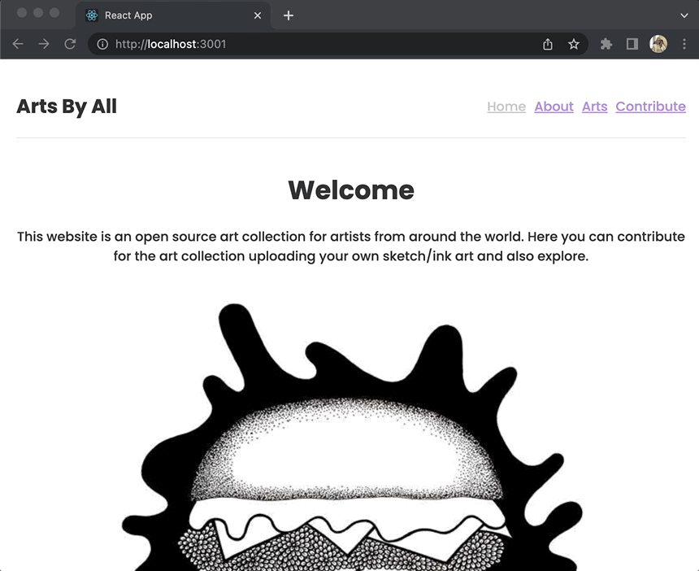

# Arts By All

Arts By All is a single page web application created with React. It is an open source art collection where you can explore and upload arts, contributing to the collection.

## Usage
This project utilizes client-side routing, making the user able to interact with links to change URLs and have the UI updated. Along with it, a form is made avaible to the user through the Contribute link, in order to upload arts that will be added to the art collection
  
For a walkthrough of the project web page, check out the YouTube video:
https://www.youtube.com/watch?v=CzPgnsIEIQo

To have direct access to the webpage, just click on the link:
ADD
  
### Navigating
Once the web page is loaded, a user should be able to see the following:

There are 4 navbar links on the top right of the page which the user can interact with to render different types of content:
ADD

### Arts collection
Once a user clicks on the Arts link, an art collection is rendered:
ADD
If a user clicks on top of an art card, more details about that art will be displayed:
ADD

### Contribute
The contribute link renders a form which the user can upload an art filling up the requested information and submit:
ADD
Once the art is submitted, the user is able to check the art clicking on the Arts link that takes to the art collection:
ADD

## Support
For any questions related to the project's functionality, code, or usage, please reach out to:  
brasildu@gmail.com
